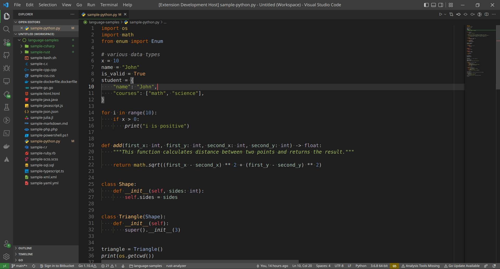

# Pulsar Theme

The **Pulsar Theme** is a dark color scheme designed to be pleasant, aesthetic and to reduce eye strain when coding for long periods of time. It uses a combination of muted colors and vibrant accents to create visually appealing and cohesive look.

### Syntax highlighting with semantic support

This theme is designed to enhance your coding experience with syntax highlighting using precisely matched colors. It also includes carefully adjusted token colors for semantic highlighting. If you wish to enrich syntax coloring based on language server data, enable semantic highlighting in your settings. The color scheme should fit well with all available programming languages.

### Theme variants

The Pulsar Theme comes with three workbench variants:
* Pulsar (recommended, green accent)
* Pulsar Mixed (mixed green/orange accent)
* Pulsar Default (based on *Monokai Dimmed* theme)

### Contribute

Feel free to contribute or start new issue in the [repository](https://github.com/dmrowiec-pl/pulsar-theme.git "Pulsar Theme repository") in case of any improvement ideas or found inconsistencies.

### Examples

* **Javascript / Typescript**

* **Python**

* **Rust**

* **Java**

* **C++**

* **HTML**

* **CSS**

* **Markdown**

* **JSON**

